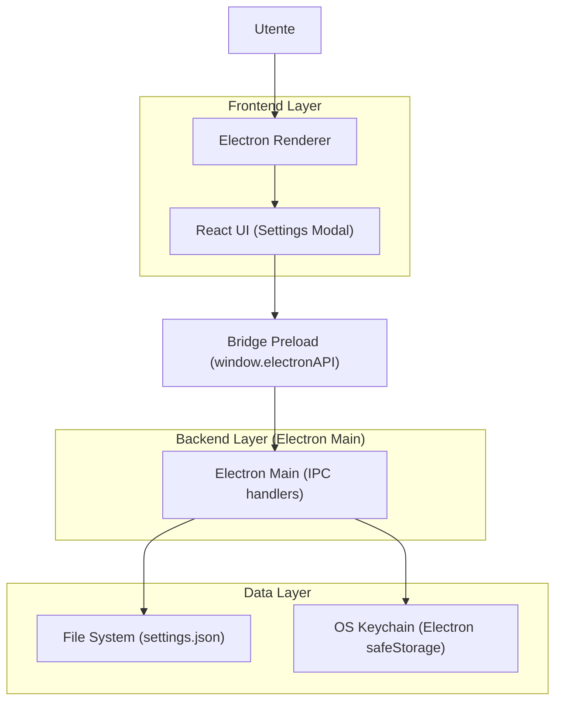

## 1.Architecture design


## 2.Technology Description
- Frontend: React@19 + TypeScript + tailwindcss@3 + vite@6
- Backend: Electron@39 (main process + IPC)
- Database: None (persistenza su file JSON locale)

## 3.Route definitions
| Route | Purpose |
|---|---|
| UI State: HomeView | Libreria/avvio e accesso a Impostazioni |
| UI State: ReaderView | Lettura/traduzione; accesso a Impostazioni contestuale |
| UI State: SettingsModal | Editing impostazioni + azioni diagnostiche |

## 4.API definitions (If it includes backend services)
### 4.1 IPC (Renderer → Main)
- `load-settings` → carica settings da `settings.json` e (se presenti) decripta chiavi.
- `save-settings` → valida, (se disponibile) cifra chiavi con `safeStorage`, salva su `settings.json`.
- `choose-and-set-projects-base-dir` → apre dialog OS e aggiorna `customProjectsPath`.
- (altri) operazioni diagnostiche: log viewer/cartella log/cleanup, health report, gestione cestino.

Type (condiviso concettualmente):
```ts
type AIProvider = 'gemini' | 'openai'

type AISettings = {
  provider: AIProvider
  gemini: { apiKey: string; model: string }
  openai: { apiKey: string; model: string; reasoningEffort: 'none'|'low'|'medium'|'high'; verbosity: 'low'|'medium'|'high' }
  inputLanguageDefault?: string
  translationConcurrency?: number
  sequentialContext?: boolean
  legalContext?: boolean
  customPrompt?: string
  fastMode?: boolean
  proVerification?: boolean
  qualityCheck?: { enabled: boolean; verifierModel: string; maxAutoRetries: 0|1|2 }
  exportOptions?: { splitSpreadIntoTwoPages: boolean; insertBlankPages: boolean; outputFormat: 'A4'|'original'; previewInReader: boolean }
  verboseLogs?: boolean
  consultationMode?: boolean
  customProjectsPath?: string
}
```

## 6.Data model(if applicable)
### 6.1 Data model definition
- `settings.json` (in `app.getPath('userData')`) contiene l’oggetto Settings.
- Se la cifratura è disponibile: `gemini.apiKey` e `openai.apiKey` vengono persistite come `apiKeyEnc` (base64), e ripristinate in memoria su load.
- `customProjectsPath` influenza anche posizione log (cartella `logs/`).
