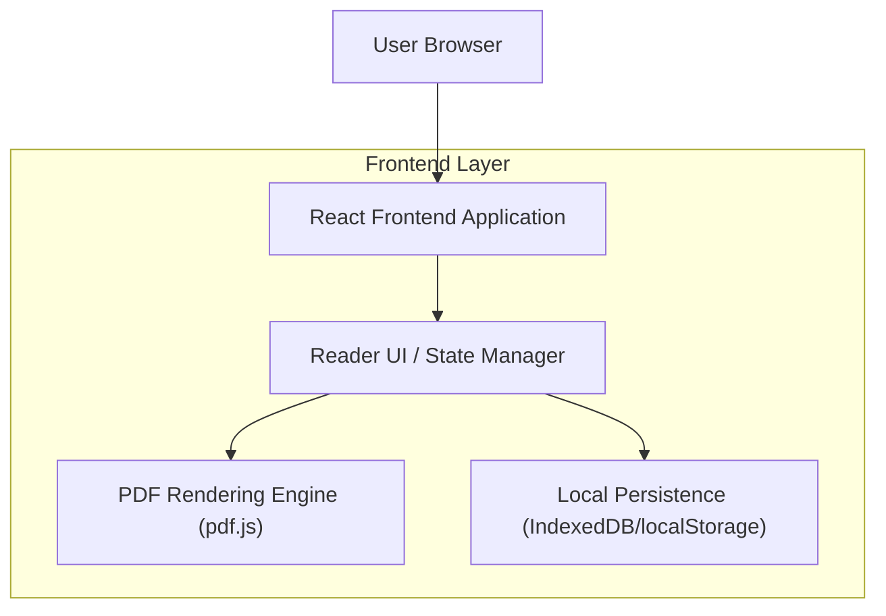

## 1.Architecture design



## 2.Technology Description

* Frontend: React\@18 + vite + TypeScript

* UI: tailwindcss\@3 (o equivalente) + componenti accessibili

* Routing: react-router

* Rendering documenti: pdfjs-dist (pdf.js)

* State: Zustand (o Redux Toolkit) + selectors

* Persistence: IndexedDB (preferito per payload più grandi) e/o localStorage (per preferenze leggere)

* Utilities: throttle/debounce (per salvataggi stato)

Backend: None (salvataggi e preferenze locali).

## 3.Route definitions

| Route          | Purpose                                                       |
| -------------- | ------------------------------------------------------------- |
| /              | Libreria: selezione documento e riprendi lettura              |
| /reader/:docId | Lettore in modalità libro con controlli e stato per documento |

## 6.Data model(if applicable)

### 6.1 Data model definition

Modello dati locale (non relazionale), salvato per chiave `docId`.

```ts
graph TD
  A["User Browser"] --> B["React Frontend Application"]
  B --> C["Reader UI / State Manager"]
  C --> D["PDF Rendering Engine (pdf.js)"]
  C --> E["Local Persistence (IndexedDB/localStorage)"]

  subgraph "Frontend Layer"
    B
    C
    D
    E
  end
```

### 6.2 Persistenza (chiavi/strategie)

* `reader.preferences`: preferenze globali (tema/temperatura/luminosità).

* `reader.docState.<docId>`: stato per documento (pagina/zoom/pan/spread).

Linee guida:

* Salvare su eventi significativi (page change, zoom end, pan end) + fallback interval throttled (es. 500–1500ms).

* Validare e normalizzare valori (limiti zoom, clamp pan) prima del commit.

* Ripristinare lo stato in modo deterministico: prima carica doc → poi applica pagina → poi zoom/pan.

### Accessibilità e UX (vincoli tecnici)

* Tutti i controlli devono essere “keyboard-first”: focus order coerente, `:focus-visible` evidente.

* Pannelli/modali: focus trap, `Esc` per chiudere, ritorno focus al trigger.

* Animazioni: rispettare `prefers-reduced-motion`; transizioni pagina opzionali e ridotte.

* Contrasto: token colori con varianti high-contrast; testi e icone con contrasto adeguato.

