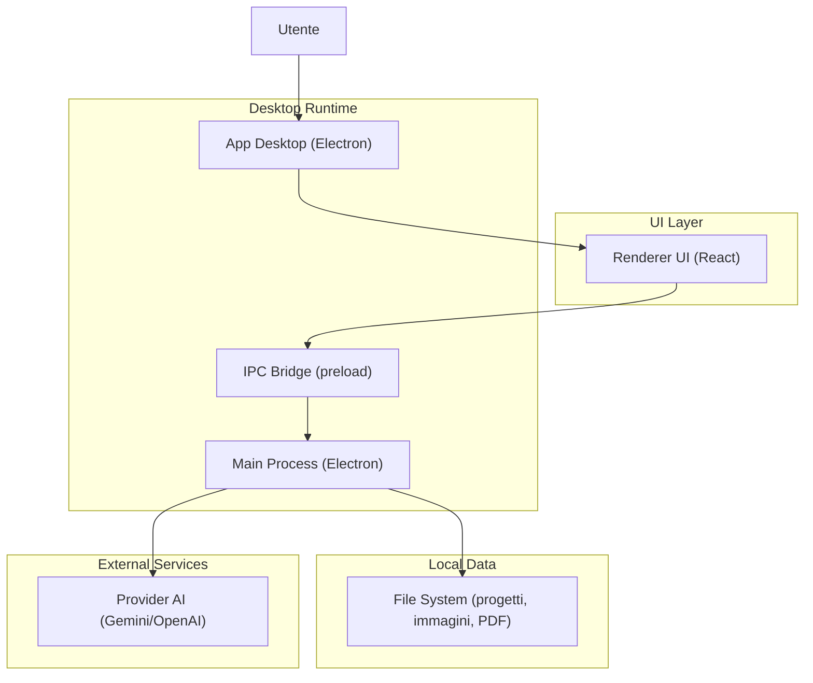

## 1.Architecture design

## 2.Technology Description
- Frontend: React@19 + tailwindcss@3 + vite
- Desktop runtime: Electron@39 (main + preload IPC)
- PDF rendering: pdfjs-dist@5
- UI icons: lucide-react
- Backend: None (no server); integrazione AI e I/O gestiti nel contesto Electron.

## 3.Route definitions
L’app è una single-window app senza routing URL; la “navigazione” è uno state toggle tra viste.

| Route (logica) | Purpose |
|---|---|
| /home | Home/Libreria: gestione sessione, upload/import, gruppi e lista progetti |
| /reader | Lettura/Traduzione: lettore e comandi di traduzione/verifica/esportazione |
| /settings (modal) | Impostazioni: API key e parametri AI |

## 4.API definitions (If it includes backend services)
Nessuna API HTTP. Le interazioni sono via IPC Electron (es. apri file dialog, import/export pacchetti, load/save progetto).

## 6.Data model(if applicable)
Persistenza locale su filesystem per progetto (fileId), metadati e asset (miniature/immagini pagina), più preferenze utente (storage locale).