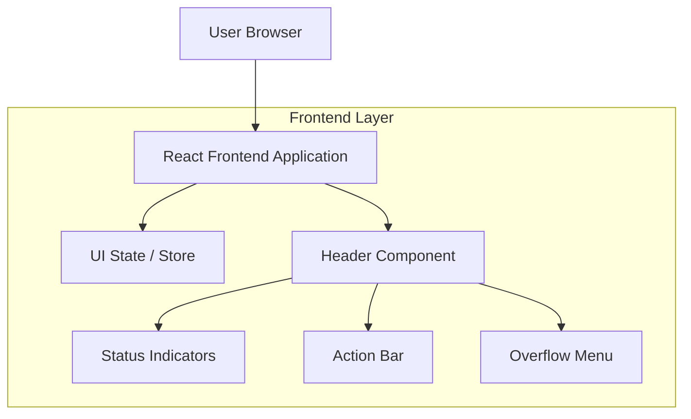

## 1.Architecture design

## 2.Technology Description
- Frontend: React@18 + TypeScript
- Backend: None (intervento UI)

## 3.Route definitions
| Route | Purpose |
|-------|---------|
| / | Schermata principale dell’app con header globale |

## 4.API definitions (If it includes backend services)
N/A

## 6.Data model(if applicable)
N/A

---

### Note tecniche di implementazione (UI)
#### Obiettivo
Rendere l’header un componente “stabile” (stessa struttura, stessi punti di ancoraggio) con:
- layout più chiaro e prevedibile
- indicatori di stato sempre leggibili
- azioni coerenti e guidate dallo stato
- accessibilità WCAG-oriented (tastiera, screen reader, focus)

#### Struttura del componente
- Header container (height fissa) con 3 aree logiche:
  1) **Left / Context**: titolo contesto, eventuale breadcrumb o nome documento/progetto (se esiste già nell’app).
  2) **Center / Status**: stato corrente + microtesto + eventuale progress.
  3) **Right / Actions**: azione primaria (1), secondarie (0–2), overflow menu per il resto.

#### Modello stati → UI
Definire una mappatura unica (es. `HeaderViewModel`) che deriva dal vero stato applicativo:
- `mode`: idle | running | success | warning | error
- `statusText`: string breve (max 1 riga)
- `progress`: null | { current: number; total: number } (se applicabile)
- `primaryAction`: { id, label, icon?, enabled, reasonIfDisabled? }
- `secondaryActions[]`
- `overflowActions[]`

Principi:
- Le azioni **non cambiano posizione** tra stati; cambia solo `enabled/disabled` e il testo di stato.
- Se un’azione è disabilitata, mostrare il motivo via tooltip/descrizione accessibile.

#### Accessibilità
- Elementi cliccabili con dimensione minima “touch target” e focus ring visibile.
- Tutti i bottoni-icona devono avere `aria-label` descrittiva.
- Area stato come `role="status"` o `aria-live="polite"` per aggiornamenti non critici; errori importanti possono usare `aria-live="assertive"`.
- Gestione focus:
  - apertura menu overflow: focus sul primo item, ESC per chiudere e ritorno focus al trigger.
  - dialog conferma: focus trap e ritorno focus al bottone chiamante.
- Ordine tab coerente: left → center → right (o left → right, lasciando center non focusabile se solo informativo).

#### Responsività (desktop-first)
- Breakpoint di riduzione spazio:
  1) ridurre lunghezze testo (ellipsis) + tooltip
  2) convertire secondarie in icone
  3) spostare azioni non critiche in overflow
- Non spostare l’azione primaria in overflow salvo casi estremi.

#### Stati visivi consigliati
- Idle: testo neutro
- Running: spinner/progress + testo “In corso…”
- Success: check + testo breve (eventualmente auto-hide in X secondi se già previsto)
- Warning/Error: colore semantic + icona + testo, con azione correttiva disponibile a destra
