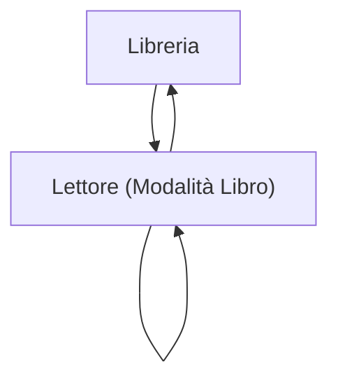

## 1. Product Overview
Riorganizzare il reader per offrire un’esperienza di lettura “come un libro”, più confortevole e controllabile.
L’utente può regolare aspetto (sfondo/temperatura/luminosità) e mantenere zoom/pan/posizione tra sessioni, con UX e accessibilità curate.

## 2. Core Features

### 2.1 Feature Module
Il prodotto minimo consiste nelle seguenti pagine principali:
1. **Libreria**: elenco documenti, ricerca rapida, riprendi lettura.
2. **Lettore (Modalità Libro)**: lettura a pagine, controlli visuali (sfondo/temperatura/luminosità), zoom/pan e ripristino stato, best practice UX/accessibilità.

### 2.2 Page Details
| Page Name | Module Name | Feature description |
|-----------|-------------|---------------------|
| Libreria | Elenco documenti | Visualizzare i documenti disponibili con titolo/anteprima minima e azione “Apri”. |
| Libreria | Riprendi lettura | Mostrare “Continua da…” (pagina o posizione) e aprire direttamente al punto salvato. |
| Libreria | Ricerca | Filtrare i documenti per nome in tempo reale. |
| Lettore (Modalità Libro) | Impaginazione “libro” | Renderizzare contenuto in modalità paginata; mostrare ombra/bordi e margini per effetto “pagina”; su desktop largo supportare layout a 2 pagine affiancate (spread) quando possibile. |
| Lettore (Modalità Libro) | Navigazione lettura | Cambiare pagina (precedente/successiva) tramite click/tap aree dedicate e comandi da tastiera; mostrare indicazione pagina corrente/total pagine. |
| Lettore (Modalità Libro) | Controlli comfort visivo | Regolare: (1) sfondo (palette temi), (2) “temperatura” colore (freddo↔caldo applicata a sfondo/testo), (3) “luminosità” (chiaro↔scuro del tema) con preview immediata. |
| Lettore (Modalità Libro) | Zoom e spostamento | Eseguire zoom in/out e pan (trascinamento) con mouse/touchpad; mantenere l’ancoraggio coerente (non “saltare” durante zoom). |
| Lettore (Modalità Libro) | Persistenza stato per documento | Salvare e ripristinare automaticamente: pagina/posizione, livello zoom, offset pan, modalità 1 pagina/2 pagine, preferenze di tema; gestire salvataggio “throttled” per performance. |
| Lettore (Modalità Libro) | UX controlli | Mostrare controlli non invasivi (toolbar + pannello impostazioni) con auto-hide opzionale; fornire feedback chiaro (toast discreti) per reset zoom/tema. |
| Lettore (Modalità Libro) | Accessibilità | Garantire navigazione completa da tastiera, focus visibile, ARIA label sui controlli, contrasto adeguato e rispetto di preferenze di sistema (es. riduzione animazioni). |

## 3. Core Process
**Flusso lettura (utente):**
1. Apri la **Libreria**.
2. Selezioni un documento o premi “Continua da…”.
3. Nel **Lettore**, leggi in modalità paginata; cambi pagina.
4. Regoli sfondo/temperatura/luminosità in base al comfort.
5. Usi zoom e pan quando serve; chiudi.
6. Alla riapertura, il documento riparte da posizione/zoom/pan salvati.

