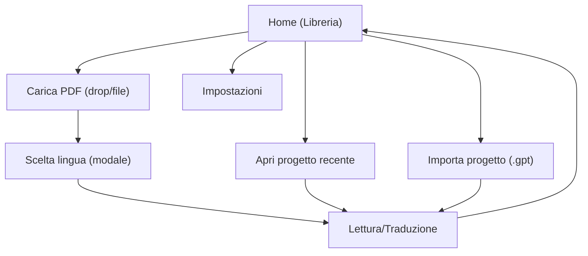

## 1. Product Overview
Redesign della Home (Libreria) di InstantTraducer per rendere più chiari: azioni principali, stato sessione, gestione progetti e configurazione API.
Obiettivo: ridurre frizione e errori, aumentare scopribilità e controllo senza aggiungere nuove funzionalità.

## 2. Core Features

### 2.1 Feature Module
1. **Home (Libreria)**: riprendi/chiudi sessione, carica PDF, importa progetto, gestione gruppi, lista progetti recenti, stato API, stato attività traduzioni.
2. **Lettura/Traduzione**: lettore, comandi traduzione/verifica/esportazione, ricerca nel testo, gestione note/annotazioni.
3. **Impostazioni**: configurazione API/parametri AI, opzioni app (incl. consultazione), azioni manutenzione libreria.

### 2.2 Page Details
| Page Name | Module Name | Feature description |
|---|---|---|
| Home (Libreria) | Stato sessione | Mostrare sessione attiva con titolo, lingua, ultima pagina e CTA “Torna alla sessione”; permettere “Chiudi sessione” con conferma/feedback. |
| Home (Libreria) | Azioni principali | Permettere “Carica nuovo PDF” via drag&drop o selezione file; disabilitare in modalità consultazione con messaggio esplicativo. |
| Home (Libreria) | Azioni secondarie | Permettere “Importa progetto (.gpt)”; mostrare accesso a “Impostazioni” e indicatore “API configurate/non configurate”. |
| Home (Libreria) | Gruppi (filtri) | Mostrare gruppi, consentire selezione multipla filtro, creazione gruppo, rimozione gruppo. |
| Home (Libreria) | Progetti recenti | Elencare progetti filtrati e ordinati; consentire aprire progetto; mostrare miniatura, lingua, progressi (pagina), data, gruppi. |
| Home (Libreria) | Azioni su progetto | Consentire rinomina, rimozione, export .gpt, gestione gruppi, cambio lingua progetto (dove disponibile). |
| Home (Libreria) | Stato traduzioni | Mostrare stato attività (summary + dettaglio) e controlli pausa/stop per progetto attivo; mostrare stato “apertura progetto” con overlay/spinner. |
| Lettura/Traduzione | Navigazione documento | Consentire lettura e navigazione pagine; mostrare stato pagine (in corso/completate/errore). |
| Lettura/Traduzione | Output & qualità | Consentire export PDF tradotto e export progetto; consentire verifica e fix pagine; mostrare errori e retry. |
| Impostazioni | Configurazione | Consentire inserimento/validazione API key e parametri AI; mostrare stato configurazione e azioni contestuali (es. apri impostazioni quando manca API). |

## 3. Core Process
**Flusso: nuovo progetto**
1) Dalla Home selezioni “Carica nuovo PDF” (o trascini un PDF). 2) Confermi la lingua (modale esistente). 3) Il progetto viene creato e si apre il Lettore.

**Flusso: riprendi progetto**
1) Dalla Home scegli un progetto dalla lista “Recenti”. 2) Vedi feedback di caricamento. 3) Entri nel Lettore sulla pagina salvata.

**Flusso: gestione libreria**
1) Dalla Home filtri per gruppi. 2) Dal menu del progetto fai rinomina/export/gestione gruppi/cambio lingua. 3) Le modifiche si riflettono nella lista.

**Flusso: configurazione API**
1) Dalla Home vedi chip “Configura API” se non pronte. 2) Apri Impostazioni e inserisci chiave. 3) Torni in Home con stato “API configurate”.

