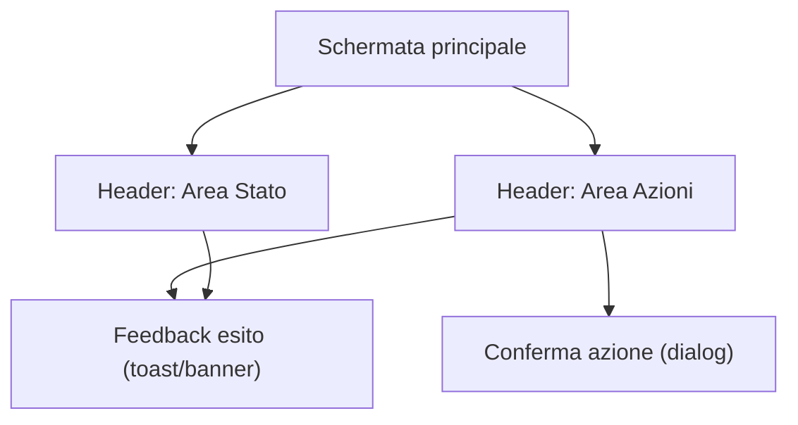

## 1. Product Overview
Riordinare la barra superiore (header) dell’app per renderla più chiara, coerente e accessibile.
L’obiettivo è mostrare meglio lo stato del lavoro e rendere le azioni principali sempre prevedibili.

## 2. Core Features

### 2.1 Feature Module
1. **Schermata principale**: header riordinato (layout), indicatori di stato, azioni coerenti, accessibilità e usabilità migliorate.

### 2.3 Page Details
| Page Name | Module Name | Feature description |
|-----------|-------------|---------------------|
| Schermata principale | Struttura header | Organizzare l’header in aree stabili (es. sinistra: contesto/navigazione, centro: stato, destra: azioni) mantenendo posizioni coerenti tra stati e dimensioni finestra. |
| Schermata principale | Indicatori di stato | Visualizzare in modo sintetico gli stati rilevanti (es. pronto/in corso/completato/errore), includendo: stato corrente, eventuale attività in corso (spinner/progress), e messaggio breve di errore/attenzione quando presente. |
| Schermata principale | Azioni principali coerenti | Presentare un set di azioni con priorità chiara (primaria/secondaria), evitando duplicazioni e cambi di posizione; disabilitare/abilitare le azioni in base allo stato e comunicare il motivo (tooltip/testo di supporto). |
| Schermata principale | Feedback e conferme | Fornire feedback immediato alle azioni (loading, successo, errore) e, quando necessario, richiedere conferma per azioni distruttive o che interrompono un processo in corso. |
| Schermata principale | Accessibilità (A11y) | Garantire navigazione da tastiera completa, focus visibile e ordine logico, label/aria-label per icone, aree cliccabili adeguate, contrasto e supporto a screen reader (aria-live per cambi stato). |
| Schermata principale | Responsività desktop-first | Definire comportamento per riduzione spazio: compressione progressiva (ridurre testo → icone con label accessibili → raggruppare in menu) senza perdere azioni critiche. |

## 3. Core Process
- Consultazione stato: apri l’app e leggi subito lo stato corrente nell’area “Stato” dell’header; se c’è un’attività in corso, vedi un indicatore di avanzamento o di lavoro.
- Esecuzione azione: scegli un’azione dall’area “Azioni”; se l’azione è temporaneamente non disponibile, l’UI lo comunica chiaramente con disabilitazione e spiegazione.
- Gestione errori: se si verifica un errore, l’header mostra uno stato “Errore” con messaggio breve; l’utente può eseguire l’azione correttiva coerente (es. riprova/annulla) dalla stessa area “Azioni”.

