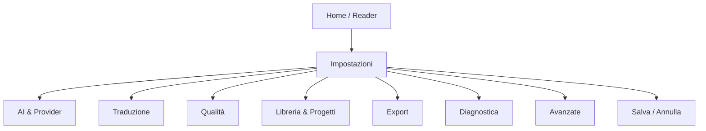

## 1. Product Overview
Riordino della schermata/modale **Impostazioni** per aumentare chiarezza, prevedibilità e sicurezza delle azioni.
Obiettivo: ridurre errori di configurazione (API/percorsi) e rendere più rapidi i task ricorrenti (test, salvataggio, diagnostica).

## 2. Core Features

### 2.1 Feature Module
Le richieste consistono delle seguenti pagine principali:
1. **Impostazioni**: navigazione per sezioni, editing impostazioni, validazione, test connessione, salvataggio/annulla, azioni diagnostiche e “zona pericolo”.

### 2.2 Page Details
| Page Name | Module Name | Feature description |
|---|---|---|
| Impostazioni | Layout & Navigazione | - Mostrare layout a 2 colonne: elenco sezioni a sinistra, contenuto a destra. - Raggruppare le sezioni per obiettivo (AI, Traduzione, Libreria, Export, Diagnostica, Avanzate). - Evidenziare sezione attiva e stato “modifiche non salvate”. |
| Impostazioni | Sezione: AI & Provider | - Selezionare provider (Gemini/OpenAI). - Mostrare solo i controlli del provider selezionato (mantenendo i valori già inseriti). - Fornire test connessione con stato (idle/testing/success/error) e messaggio inline. - Gestire modifica chiave con pattern “mascherata + pulsante Modifica/Annulla”. |
| Impostazioni | Sezione: Traduzione | - Impostare lingua input di default. - Configurare parallelismo (concurrency) e continuità narrativa (sequential). - Abilitare contesto legale. - Gestire prompt custom (carica default / reset / textarea). |
| Impostazioni | Sezione: Qualità | - Abilitare/disabilitare verifica post-traduzione. - Selezionare modello verifica e max auto-ritraduzioni (0–2). - Sincronizzare toggle “Verifica Pro” con modello verifica quando applicabile. |
| Impostazioni | Sezione: Libreria & Progetti | - Configurare cartella progetti (cambia cartella / ripristina default). - Gestire Cestino (lista, ripristina singolo/tutto, elimina definitivo, svuota) con conferme per azioni distruttive. |
| Impostazioni | Sezione: Export | - Configurare opzioni export (split spread, pagine bianche, formato A4/originale, anteprima nel reader). |
| Impostazioni | Sezione: Diagnostica | - Attivare log di debug. - Aprire log viewer/cartella log e cleanup (vecchi / tutti) con conferma. - Mostrare report integrità libreria (metriche + legenda) e azione di pulizia asset orfani quando disponibile. - Avviare self-check diagnostico. |
| Impostazioni | Sezione: Avanzate (Zona Pericolo) | - Attivare modalità consultazione (offline/sola lettura). - Esporre azioni avanzate condizionali (es. reset/ritraduci, consolidamento, unione duplicati, rinomina retroattiva) con: conferma, progress state, copy esplicativa. |
| Impostazioni | Barra Azioni (footer) | - Mostrare errori/avvisi di validazione in-line prima del salvataggio. - Abilitare “Salva” solo se configurazione minima presente per provider e validazione OK. - Offrire “Test connessione” e “Annulla”. |
| Impostazioni | Mappatura impostazioni → sezioni | - AI & Provider: provider, gemini.apiKey, gemini.model, openai.apiKey, openai.model, openai.reasoningEffort, openai.verbosity, fastMode. - Traduzione: inputLanguageDefault, translationConcurrency, sequentialContext, legalContext, customPrompt. - Qualità: qualityCheck.enabled, qualityCheck.verifierModel, qualityCheck.maxAutoRetries, proVerification. - Libreria & Progetti: customProjectsPath, cestino (operazioni). - Export: exportOptions.splitSpreadIntoTwoPages, exportOptions.insertBlankPages, exportOptions.outputFormat, exportOptions.previewInReader. - Diagnostica: verboseLogs, log viewer/cleanup, health report. - Avanzate: consultationMode + azioni condizionali. |

## 3. Core Process
**Flusso utente (generale)**
1) Apri Impostazioni dalla UI. 2) Naviga tra sezioni. 3) Modifica valori (con validazione immediata). 4) Esegui “Test connessione” se tocchi provider/chiavi. 5) Salva per applicare; Annulla per uscire senza applicare.

**Flusso provider**
- Se cambi provider: la UI mostra solo controlli compatibili; il salvataggio richiede chiave presente per il provider attivo.

**Flusso azioni critiche (cestino/log/avanzate)**
- Prima di azioni distruttive: mostra conferma esplicita; durante esecuzione: stato “in corso”; al termine: feedback.

